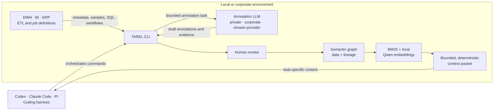

# TAREL

[](https://github.com/Mattiascherzgit/tarel/actions/workflows/ci.yml)
[](https://www.python.org/downloads/)
[](https://github.com/Mattiascherzgit/tarel/blob/master/LICENSE)

**Give coding agents a semantic map of enterprise data and lineage.**



TAREL helps coding agents navigate data warehouses, BI platforms, ERP schemas, and ETL landscapes
that are too large, cryptic, or interconnected for grep and a single prompt. It discovers technical
structures and execution flows, turns bounded evidence into reviewable semantic annotations, and
compiles only the tables, fields, relationships, jobs, and lineage paths relevant to the current
task.

TAREL stands for **Topology, Annotation, Retrieval, Evidence & Lineage**.

### One question across several systems

TAREL does not require independent source graphs to be flattened into one catalog. A workspace
groups them into systems, areas, schemas, and overlapping zones, while reviewed workspace
relationships connect fields that belong together across graph boundaries. The same selectors are
used by discovery and context compilation:

```bash
tarel search enterprise "customer revenue" \
  --workspace --system commercial --zone revenue --mode bm25
tarel context build enterprise "customer revenue" \
  --workspace --system commercial --zone revenue --mode bm25
```

Both commands resolve the scope before ranking and emit the same deterministic scope hash. The
context can expand across validated workspace relationships, but never across draft or rejected
claims. Source graphs remain independent and unchanged.

Operational lineage is kept explicit as a second path: use tolerant `lineage find` to locate a
report, measure, job, procedure, table, or field, then pass the returned exact reference to the
fail-closed `lineage upstream` trace.

For demand-driven discovery, persist that trace as a **focus**. A focus is a revision-bound slice
from one report or mart back to its currently known origins. It can drive annotation and missing-
relationship probes without scanning unrelated legacy objects:

```bash
tarel focus build commercial-sales \
  --seed powerbi.Sales.Report.TotalSales \
  --lineage reporting --lineage dbt --lineage warehouse-etl \
  --graph marts --graph warehouse
tarel annotation plan --focus commercial-sales
tarel relationship discover warehouse \
  --object Fact.Sale --focus commercial-sales \
  --config private.toml --dry-run
```

Every lineage and structural graph revision is recorded. Annotation edits do not invalidate the
slice, but renamed objects, changed topology, or changed lineage make it stale and require an
explicit rebuild. `--expand-one-hop` can add immediate declared-FK neighbors during relationship
discovery while keeping the candidate search bounded.

### Built for coding harnesses

TAREL is primarily a CLI for coding harnesses such as Codex, Claude Code, Pi, and similar agent
environments. The harness controls discovery, annotation, review, retrieval, and context compilation
through explicit commands.

TAREL supports two annotation modes:

- **Coding-agent mode:** the harness receives one bounded annotation task and proposes the semantic
  description. This needs no separate provider and works well for exploration and small systems.
- **Private-provider mode:** TAREL sends bounded evidence directly to a configured annotation model.
  This can be a smaller corporate model exposed through a supported provider adapter. The frontier
  harness can operate on the resulting graph and context without receiving the complete sample or
  procedure payload.

A provider profile makes that privacy choice operational: `local` can target a loopback llama.cpp
or MLX server, a named `corporate` profile can target a private Qwen or DeepSeek service, and a
cloud profile can target OpenRouter, OpenAI, or another approved endpoint. Annotation and lineage
commands stay identical; only `--provider PROFILE` changes.

Generated descriptions, relationships, and lineage claims begin as proposals. A human can validate,
edit, reject, or defer them before they become trusted knowledge.

### Semantic retrieval is the recommended path

Exact search and BM25 work well for source code and clearly named schemas. Enterprise information
systems are different: names are abbreviated, business meaning lives in annotations, and relevant
objects may be spread across hundreds of tables and several schemas.

TAREL therefore combines BM25 for exact identifiers, local Qwen embeddings for business language
and synonyms, graph expansion for trusted relationships, and bounded context compilation for the
final agent prompt. Only allowlisted graph metadata is embedded; connection strings, sample values,
and arbitrary provenance are excluded from the vector index.

```text
discover -> annotate -> human review -> embed -> retrieve -> compile context
```

TAREL keeps its kernel small and dependency-free. When a source is unknown, the coding harness can
create and test an isolated connector candidate from TAREL's contracts. A human reviews the code and
observed results before activation, so the installation can extend itself without silently changing
the trusted kernel.

> TAREL is pre-alpha software. The CLI, experimental SDK, and serialized contracts may still
> change during `0.x`. Native orchestration exporters, ETL run history, and semantic-standard
> interoperability are not part of the current release.

## Getting started

```bash
python -m pip install tarel
tarel --version
```

This installs the dependency-free core. TAREL supports Python 3.11 and 3.12. For realistic
information systems, the recommended installation adds local semantic retrieval:

```bash
python -m pip install 'tarel[local-rag]'
```

Source-specific drivers remain separate:

```bash
# SQL Server through pymssql
python -m pip install 'tarel[sqlserver]'
```

The embedding runtime is optional and isolated from the core. `tarel model download` is always an
explicit action; it downloads the pinned model, verifies its checksum, and never runs during
package import.

### Embed the same engine through Python

The SDK calls the same application use cases as the CLI and requires an explicit local state root:

```python
from tarel.sdk import Tarel, WorkspaceScope

tarel = Tarel(root="/path/to/project/.tarel")
scope = WorkspaceScope(
    systems=("commercial",),
    areas=("analytics",),
    zones=("revenue",),
)

bundle = tarel.grounding.context(
    "customer revenue",
    workspace="enterprise",
    selection=scope,
    sources=("warehouse-prod",),
    lineages=("reporting", "dbt", "warehouse-etl"),
    mode="bm25",
)
stable_system_prefix = bundle.stable_prompt()
dynamic_turn_context = bundle.dynamic_prompt()
view = tarel.view.workspace(
    "enterprise",
    lineages=("reporting", "dbt", "warehouse-etl"),
    selection=scope,
)
```

The `GroundingBundle` maps every selected object to a non-secret source target containing its graph
revision, connector, catalog, source type, and SQL dialect. It combines a cache-friendly stable
prefix with the dynamic question, retrieval decisions, visible omissions, optional lineage matches,
and an exact upstream trace. Connection endpoints and credentials never enter this contract. The
client does not change the working directory or invoke CLI subprocesses. Lower-level search results,
context packets, lineage traces, focuses, and review records remain available as the same typed
deterministic contracts used by CLI commands. The combined view projection contains both Space
objects and Lineage flows, so a GUI can switch modes without rebuilding either model. See
[the SDK guide](docs/sdk.md).

## Demo walkthrough

The bundled Retail DWH is the safest way to try TAREL. It contains synthetic analytical data,
requires no credentials, and is created only when requested.

### 1. Create and probe the source

```bash
tarel demo create retail-dwh
tarel source configure retail-local \
  --connector sqlite \
  --config-ref state:demos/retail-dwh.toml \
  --namespace main
tarel source check retail-local
tarel source probe retail-local
```

The generated SQLite database, private configuration, and source registry live below the ignored
`.tarel/` directory. A source profile stores only a logical name and a config reference, never the
connection URL itself.

Inspect the catalog or a bounded sample:

```bash
tarel source discover retail-local

# The lower-level connector interface remains available for explicit sampling.
tarel connector sample sqlite \
  --config .tarel/demos/retail-dwh.toml \
  --schema main \
  --object F_SLS_01 \
  --limit 3
```

### 2. Build the technical graph

```bash
tarel source build retail-local retail-demo

tarel graph show retail-demo
```

The demo graph contains date, product, customer, geography, reseller, currency, and channel
dimensions; two sales facts; a return fact; a mapping table; and a union view. Its fact names are
deliberately abbreviated so that semantic annotation provides measurable value.

### 3. Annotate and review meaning

For repeatable or parallel annotation, configure a provider and let TAREL call it directly. The
profile name is also the explicit data boundary. This example uses OpenRouter:

```bash
export TAREL_OPENROUTER_API_KEY="..."
tarel provider configure openrouter \
  --from-env \
  --model YOUR_MODEL_ID
tarel provider test openrouter

tarel graph annotate retail-demo \
  --provider openrouter \
  --config .tarel/demos/retail-dwh.toml \
  --samples 5 \
  --workers 4
```

With an appropriate provider adapter and endpoint, this boundary can point at a privately hosted
corporate model. The coding harness controls the command while TAREL sends the bounded annotation
payload to that profile and persists only the resulting proposals and evidence. A local llama.cpp,
MLX, or similar server uses the same annotation path without placing inference inside TAREL:

```bash
tarel provider configure local \
  --no-api-key \
  --model YOUR_LOCAL_MODEL_ID \
  --base-url http://127.0.0.1:8080/v1 \
  --structured-mode tool
tarel provider test local
```

TAREL also works without a separate provider. Ask for one complete task and let the coding agent
already operating the CLI produce the structured proposal:

```bash
tarel annotation next retail-demo \
  --samples 5 \
  --config .tarel/demos/retail-dwh.toml > annotation-task.json

# Give annotation-task.json to the coding agent and save its response as proposal.json.
tarel annotation apply retail-demo --input proposal.json
```

Both paths create drafts. Review state is explicit, and a human decides what becomes trusted:

```bash
tarel annotation show retail-demo main.D_CHNL
tarel annotation validate retail-demo main.D_CHNL \
  --include-fields \
  --reason "Reviewed against the demo schema and bounded samples."
```

Every proposal covers the selected object and all supplied fields. Samples are input-only: they
are not persisted in the graph and must not be repeated in generated descriptions.

#### Optional local browser review

When a human wants to inspect the topology or work through semantic proposals visually, start the
local browser UI. It uses the same application operations as the CLI and SDK:

```bash
# Read-only graph and annotation inspection
tarel ui retail-demo

# Add selected lineage documents and explicitly enable review changes
tarel ui retail-demo \
  --lineage REPORT_LINEAGE \
  --lineage ETL_LINEAGE \
  --edit

# Open all graphs in a workspace, optionally narrowed by the shared scope resolver
tarel ui --workspace enterprise --system commercial --zone revenue \
  --lineage REPORT_LINEAGE --lineage ETL_LINEAGE

# Open one or combine several saved report-to-source focuses
tarel ui --workspace enterprise \
  --lineage REPORT_LINEAGE --lineage ETL_LINEAGE \
  --focus commercial-sales --focus executive-margin
```

The UI binds only to `127.0.0.1`, makes no external requests, and adds no Python dependency. Its
graph view can show one graph or a filtered multi-graph workspace. Its **Space** mode groups the
estate by system, area, graph, and schema; **Lineage** mode replaces schema relationships with the
selected data and process flows. Resolved upstream traces can be moved from the evidence drawer
onto the same canvas. Client-side scope controls can hide systems, areas, graphs, schemas, and
zones without changing persisted workspace definitions. The annotation queue puts table and view
descriptions first, keeps evidence
beside the editor, and can approve a table together with all field proposals. Zones can be created
from a selected object; additional objects can then be dragged onto the zone. In edit mode, the UI
can also create a manual procedure or script and connect one source object to one target object
through that job. These entries live in a separate manual overlay, and every new hop starts as a
reviewable draft.

Saved focuses form an independent UI filter over Space and Lineage. The browser lists compatible
report and cube focuses, supports text search and multi-selection, and renders only the union of
the chosen paths. This keeps a workspace with thousands of discovered tables usable while its
catalog grows from the first report to hundreds of application-specific slices. The catalog sends
only summaries initially; exact members and hops are loaded when focuses are selected. Clear the
selection to return to the complete workspace.

The default is read-only. `--edit` is required for annotation decisions and workspace changes.
Every graph write carries its loaded revision, so a stale browser tab cannot silently overwrite a
newer CLI or SDK change. Manual lineage writes and decisions use the same revision protection.

### 4. Discover the deliberately missing relationship

`F_SLS_02.RSLR_KEY` plausibly joins `D_RSLR.RSLR_KEY`, but the demo intentionally declares no
foreign key. TAREL can test a small set of type-compatible candidates with bounded SQL aggregates:

```bash
tarel relationship discover retail-demo \
  --object main.F_SLS_02 \
  --field RSLR_KEY \
  --config .tarel/demos/retail-dwh.toml

tarel relationship list retail-demo
```

Discovery stores counts and ratios, not the probed values. The result remains a draft and is not
used for graph expansion until a human validates its edge ID:

```bash
tarel relationship validate retail-demo RELATIONSHIP_ID \
  --reason "The domain overlap and target uniqueness were reviewed."
```

### 5. Embed, retrieve, and compile agent context

For real information systems, build the local semantic index after annotation or review changes:

```bash
tarel model download
tarel model status
tarel index build retail-demo

tarel search retail-demo \
  "internet and reseller sales by year" \
  --mode hybrid \
  --limit 10

tarel context build retail-demo \
  "internet and reseller sales by year" \
  --mode hybrid \
  --max-objects 10
```

Hybrid retrieval combines exact BM25 matches with local Qwen embeddings over names, descriptions,
roles, synonyms, semantic types, and other allowlisted graph metadata. The context result then
expands those semantic anchors through reviewed graph relationships. It does not execute the
analytical aggregation itself.

If the optional embedding runtime is not installed, `--mode bm25` remains the dependency-free
fallback. TAREL fails visibly rather than silently downgrading a requested vector or hybrid search.

Conceptually, the agent receives a bounded packet like this:

```text
STABLE CONTEXT
graph: retail-demo
objects:
  main.F_SLS_01  "Internet sales fact"                 [draft]
  main.F_SLS_02  "Reseller sales fact"                 [draft]
  main.D_DATE    "Calendar dimension"                  [validated]
joins:
  F_SLS_01.DOC_DT_KEY -> D_DATE.DATE_KEY                [foreign_key]
  F_SLS_02.RSLR_KEY -> D_RSLR.RSLR_KEY                 [candidate, draft]

DYNAMIC REQUEST
query: internet and reseller sales by year
selection: ...
omissions: ...
```

This is illustrative rather than copied output; the real text and JSON renderers include stable
identities, review states, paths, retrieval reasons, budgets, warnings, hashes, and visible
omissions. Unreviewed proposals may be included, but their state is never hidden.

### 6. Reproduce schema drift

Save the first packet, replace the local demo source with V2, refresh the graph, and check impact:

```bash
tarel context build retail-demo \
  "internet and reseller sales by year" \
  --mode hybrid \
  --format json > retail-context-v1.json

tarel demo create retail-dwh --version 2 --force
tarel graph refresh retail-demo \
  --config .tarel/demos/retail-dwh.toml

tarel context impact retail-context-v1.json --graph retail-demo
```

V2 changes selected types and keys, adds and removes fields, renames a reseller field, and removes
one declared relationship. Change Radar preserves affected claims, moves validated annotations to
`review_required`, retains removed knowledge as stale claims, and identifies affected workspace
areas, zones, and context packets.

See the complete [Retail DWH walkthrough](https://github.com/Mattiascherzgit/tarel/blob/master/docs/retail-demo.md).

## Command reference

The harness-facing surface stays explicit and composable:

| Command | Purpose |
|---|---|
| `tarel demo` | Create deterministic local demo sources |
| `tarel source` | Configure logical sources and probe, discover, build, or refresh through them |
| `tarel connector` | Check, probe, discover, sample, and scaffold source connectors |
| `tarel graph` | Build, refresh, inspect, and provider-annotate technical graphs |
| `tarel focus` | Persist revision-bound report-to-source slices for demand-driven work |
| `tarel annotation` | Plan, exchange, apply, inspect, edit, and review semantic proposals |
| `tarel relationship` | Add, probe, discover, inspect, and review possible joins |
| `tarel lineage` | Build, refresh, analyze, inspect, and review static process and table lineage |
| `tarel model` | Explicitly download and verify the optional local embedding model |
| `tarel index` | Build and inspect rebuildable local vector indexes |
| `tarel search` | Retrieve relevant objects and fields through lexical, BM25, vector, or hybrid search |
| `tarel context` | Build, compare, and impact-check deterministic agent context packets |
| `tarel grounding` | Compile agent-ready context with source, dialect, and optional lineage identity |
| `tarel workspace` | Organize graphs into systems, areas, schemas, and overlapping zones |
| `tarel provider` | Configure, inspect, and test optional annotation providers |

Every substantive command supports deterministic JSON where machine consumption is useful. Run
`tarel COMMAND --help` or `tarel COMMAND SUBCOMMAND --help` for the exact installed interface. The
sections below document connector authoring, annotation, lineage, retrieval, workspaces, and local
persistence in more detail.

## Caching options

TAREL separates four kinds of reuse instead of hiding them behind one opaque cache:

| Layer | Stored locally | Invalidation boundary |
|---|---|---|
| Model cache | Checksum-verified GGUF embedding model | Explicit model identity and SHA-256 |
| Retrieval index | Allowlisted graph documents and normalized vectors in SQLite | Graph revision, retrieval contract, and model SHA-256 |
| Provider analysis cache | Schema-validated lineage workfiles without procedure source | Source identity, prompt contract, model, and reasoning settings |
| Harness prompt cache | Consumer-managed stable prefix from a context packet | Stable hash and graph revision |

`TAREL_CACHE_DIR` changes the model cache root; otherwise TAREL follows `XDG_CACHE_HOME` and then
the platform user cache. `TAREL_EMBEDDING_MODEL` can point to an existing GGUF. Vector indexes live
under `.tarel/indexes/` and are rebuilt explicitly after graph or annotation changes:

```bash
tarel model status
tarel index status retail-demo
tarel index build retail-demo
```

For LLM prefix caching, `tarel.context.v0.2` places the deterministic `stable` section before the
question-specific `dynamic` section. It emits graph revision, stable hash, dynamic hash, complete
packet hash, ordered content, and visible omissions without timestamps, runtimes, or volatile local
paths. A harness can reuse the stable JSON prefix and map its hash to provider-specific cache
controls without TAREL depending on that provider.

Context size and trust are explicit CLI choices:

```bash
# Small or large system: retrieve only a question-specific snippet.
tarel context build retail-demo \
  "internet and reseller sales by year" \
  --mode hybrid \
  --namespace main \
  --max-objects 10 \
  --max-joins 12 \
  --max-hops 2 \
  --max-fields-per-object 12 \
  --max-characters 24000 \
  --format json > packet.json

# Small graph or repeatedly used workspace zone: compile a query-independent prefix.
tarel context prefix retail-demo \
  --namespace main \
  --max-objects 250 \
  --max-characters 500000 \
  --format json > retail-prefix.json

tarel context prefix enterprise \
  --workspace \
  --system commercial \
  --zone revenue \
  --format json > revenue-prefix.json

tarel context diff packet-a.json packet-b.json
tarel context impact packet.json --graph retail-demo
```

The Python SDK additionally exposes `tarel.context.split(packet)`. It returns a stable JSON block,
a request-specific JSON block, and their hashes so an embedding application can place them in the
appropriate system and user messages. `prefix_graph(...)` and `prefix_workspace(...)` return a
complete query-independent packet for a selected graph, system, area, schema, or overlapping zone.

For a BI-agent turn that also needs source routing and explicit lineage identity, compile the
higher-level grounding contract:

```bash
tarel grounding enterprise "annual net sales" \
  --workspace --system commercial --zone revenue \
  --lineage reporting --lineage warehouse-etl \
  --trace powerbi.Sales.Report.NetSales \
  --mode hybrid --format json > grounding.json
```

`tarel.grounding.v0.1` preserves the context packet unchanged, then adds non-secret source targets,
SQL dialects, selected lineage revisions, tolerant lineage matches, and an optional exact upstream
trace. Its text form is split into a stable system-prefix block and a dynamic turn block. Evidence
reasons and review state remain visible, while volatile evidence paths and connection details are
excluded from the agent contract.

TAREL deliberately does not invent TTLs, provider cache headers, or session affinity. Those remain
harness concerns; the neutral packet supplies the deterministic boundaries needed to implement
them. See the [context packet contract](https://github.com/Mattiascherzgit/tarel/blob/master/docs/context-contract.md).

## The problem it solves

An agent can inspect a small, well-named schema directly. Real analytical estates contain hundreds
of abbreviated tables, missing foreign keys, undocumented measures, multiple source systems, and
knowledge that exists only in people's heads. Dumping the full schema into a prompt wastes context
and still leaves the agent guessing.

TAREL builds a reusable map instead. Connectors observe bounded technical evidence; annotation
models propose meaning; humans review it; retrieval chooses useful graph anchors; and the context
compiler emits only the relevant objects, fields, joins, warnings, and provenance. A separate
static-lineage path records workflow order, procedure calls, direct writes, and proposed physical
objects without pretending that job order alone is data lineage.

The source system remains authoritative: TAREL stores metadata and reviewable claims, not a copy of
the warehouse.

## Design principles

- **Self-extending, human-gated.** A coding agent can build missing source adapters locally from
  explicit contracts; generated code remains isolated and inactive until reviewed.
- **Local first.** Graphs, indexes, reviews, and context packets work without a hosted service.
- **Evidence before confidence.** Technical observations, generated proposals, and human-validated
  knowledge remain distinguishable.
- **Human-reviewed semantics.** Generated descriptions and inferred joins begin as proposals, never
  as silent truth.
- **Small, stable context.** Deterministic ordering, explicit budgets, hashes, and visible omissions
  make output inspectable and cache-friendly.
- **Optional complexity.** The core uses only the Python standard library. Database drivers, local
  embeddings, and remote LLM calls are opt-in.
- **Agent-native, provider-neutral.** The harness can research and extend TAREL; an optional provider
  handles repeatable parallel annotation jobs.

## Implemented features

| Area | Current capability |
|---|---|
| Self-extension | Agent-readable connector tasks, isolated candidates, versioned manifests, dialect references, and a human activation gate |
| Connector runtime | Stable read-only contracts for probing, metadata discovery, sampling, and bounded relationship evidence |
| Discovery | Catalog, namespace, table, view, field, type, nullability, primary key, foreign key, and technical description observations |
| Sampling | Explicit, deterministic samples of 1–10 rows with field, value-size, and total-size limits |
| Graph | Stable technical node and edge identities; atomic local JSON persistence; deterministic revisions |
| Annotation | Provider-free coding-agent tasks and optional OpenRouter-backed parallel batches |
| Human review | Draft, validated, rejected, deferred, and `review_required` states with preserved originals and review reasons |
| Relationships | Declared foreign keys, human-defined joins, and bounded aggregate discovery of missing relationship candidates |
| Retrieval | Deterministic lexical search, dependency-free BM25, optional local vector search, and hybrid reciprocal-rank fusion |
| Context | Bounded object, field, join, and hop selection with visible paths, reasons, warnings, and omissions |
| Cache-friendly output | Stable and dynamic packet sections, graph revision, canonical hashes, packet diffing, and refresh impact checks |
| Static lineage | Workflow order, declared bindings and materializations, evidence-backed write units, direct table lineage, human review, revision-aware refresh, and validated provider-workfile caching |
| Demand-driven focus | Reproducible report-to-source slices that bound annotation and relationship discovery |
| Workspaces | `system → area → schema` hierarchy plus explicit overlapping zones across schemas |
| Change Radar | Field, key, object, and relationship drift; possible renames; stale claims; affected areas, zones, and context packets |
| Demo | Deterministic local Retail DWH with a deliberate missing relationship and reproducible V1→V2 schema drift |

The runtime core has no mandatory third-party dependency. SQLite uses Python's standard library.
SQL Server and local embeddings are optional extras.

## Teach TAREL a new source

The long-term value of TAREL is not a large built-in connector inventory. It is a small connector
contract that a capable coding agent can implement when it meets a new database or warehouse. The
same authoring pattern is intended for lakes, document systems, and orchestration platforms as
their contracts are added.

Start by creating an isolated candidate:

```bash
tarel connector scaffold postgres \
  --output .tarel/connectors/postgres-candidate
```

Then give the coding agent already operating TAREL a concrete instruction:

> Implement the connector described in
> `.tarel/connectors/postgres-candidate/CONNECTOR_TASK.md`. Use official vendor documentation,
> keep the driver optional, implement the read-only probe first, record only the required dialect
> and metadata notes under `references/`, and stop after local tests for human review.

The generated workspace gives the agent:

- an explicit versioned connector contract and capability boundary;
- an inactive Python adapter with the required entry point;
- a read-only manifest for dependencies, permissions, dialect, and references;
- focused authoring and SQL-dialect reference files;
- rules for secret handling, bounded probes, stable ordering, and visible failures;
- a completion gate that requires testing against a private source and human review.

The agent may consult current official documentation when a proprietary metadata API or SQL dialect
is unknown. It can then edit the candidate, install only the source-specific driver, and iterate on
`probe` and `discover_catalog` using real error output. This is the self-modifying loop: the tool
provides the contract and evidence boundary; the coding agent supplies the source-specific code.

After private-source testing and human review, activate the candidate as an ordinary Python
package. TAREL discovers it only through the named `tarel.connectors` entry point:

```bash
python -m pip install .tarel/connectors/postgres-candidate
tarel connector check postgres
tarel source configure warehouse-prod \
  --connector postgres \
  --config-ref env:TAREL_WAREHOUSE_CONFIG \
  --database warehouse \
  --namespace analytics
tarel source probe warehouse-prod
tarel source build warehouse-prod warehouse-graph
```

Today, `scaffold` creates the complete authoring workspace but does not invoke an LLM by itself,
install the candidate, or execute generated code. Installation and source registration are explicit
human decisions. That gate is intentional: self-extension should remove repetitive integration
work, not turn unreviewed generated code into trusted infrastructure.

## Logical source registry

A source profile connects a stable local name to one reviewed connector and one private config
reference. `env:VARIABLE` resolves to a TOML path supplied by the host; `state:relative/path.toml`
resolves only below the selected `.tarel` state directory. Raw URLs and path traversal are rejected.
Profiles are always read-only and may be associated with one or more graphs.

If exactly one registered source maps to a selected graph, grounding includes its logical name and
source-profile revision automatically. Multiple mappings fail closed until the caller selects the
intended profile with `--source NAME` or `sources=(NAME,)`. The grounding contract never contains
the config reference or its resolved URL.

## Connector runtime

Built-in and installed connectors use the same small CLI surface:

```bash
tarel connector check NAME
tarel connector probe NAME --config private.toml
tarel connector discover NAME --config private.toml --schema SCHEMA
tarel connector sample NAME --config private.toml --schema SCHEMA --object OBJECT
```

Connectors are read-only adapters. They produce normalized observations and never mutate a TAREL
graph directly. The current distribution includes SQLite and SQL Server as working references for
the contract, not as the intended limit of the system.

Private connector files use TOML sections matching the connector name. They must remain outside
Git. Environment variables such as `TAREL_SQLSERVER_URL` can override local URLs.

## Semantic annotation and review

Two execution modes use the same annotation contract:

- **Coding-agent mode:** `annotation plan`, `next`, and `apply` exchange JSON with the agent already
  operating the CLI.
- **Provider mode:** `graph annotate` calls an optional provider once per object and can run several
  independent calls in parallel.

Provider profiles keep inference placement separate from annotation and lineage. Built-in protocol
adapters cover OpenRouter and OpenAI-compatible Chat Completions. The OpenAI-compatible adapter
also covers local llama.cpp/MLX servers, private vLLM servers, hosted OpenAI APIs, and corporate
gateways when they implement the required structured-output mode.

Configure a private corporate endpoint:

```bash
export TAREL_PROVIDER_CORPORATE_API_KEY='...'
tarel provider configure corporate \
  --adapter openai-compatible \
  --from-env \
  --model PRIVATE_MODEL_ID \
  --base-url https://inference.example.com/v1 \
  --structured-mode json_schema
tarel provider test corporate
```

Or configure OpenRouter without writing a key into the repository:

```bash
export OPENROUTER_API_KEY='...'
tarel provider configure openrouter --from-env --model MODEL_NAME
tarel provider test openrouter
```

Unknown proprietary APIs remain outside the kernel. `tarel provider scaffold NAME` creates an
inactive adapter package below `.tarel/providers/NAME`, together with a protocol evidence file,
security boundaries, tests to implement, and a Python entry point. The coding harness can implement
it from official vendor documentation, but TAREL discovers it only after the human has reviewed and
installed the candidate.

Run a bounded batch:

```bash
tarel graph annotate retail-demo \
  --provider openrouter \
  --workers 4 \
  --retry 1 \
  --samples 5 \
  --config .tarel/demos/retail-dwh.toml
```

Using `--samples` with a remote provider is an explicit data-boundary decision and is announced on
stderr. Without it, only technical metadata and graph relationships are sent.

Review commands never silently turn generated meaning into trusted meaning:

```bash
tarel annotation list retail-demo --state draft
tarel annotation show retail-demo main.F_SLS_01.NET_AMT
tarel annotation edit retail-demo main.F_SLS_01.NET_AMT \
  --input annotation-patch.json \
  --reason "Definition supplied by the data owner"
tarel annotation validate retail-demo main.F_SLS_01.NET_AMT \
  --reason "Definition and currency behavior confirmed"
tarel annotation defer retail-demo main.F_SLS_01 \
  --reason "Waiting for the data owner"
tarel annotation reject retail-demo main.F_SLS_01 \
  --reason "Proposed meaning is incorrect"
```

Human edits preserve the original proposal. Rejected claims are hidden from retrieval while the
technical schema stays available.

## Static process and table lineage

TAREL can model design-time ETL behavior without installing an orchestration platform or copying
procedure code into its persisted lineage document. A strict input document supplies observed
workflow steps and complete definitions. TAREL persists their identities and hashes, then keeps
three different facts separate:

- **Process order:** which workflow step runs after which predecessor.
- **Calls:** procedures or scripts directly invoked by a definition.
- **Table lineage:** one persistent write target and the proposed physical sources that influence
  that write, each with exact source evidence and temporary objects only as an explicit `via` path.

The input boundary is `tarel.lineage-input.v0.1`. A source-specific exporter can be a small local
adapter created by the coding agent for SQL Server Agent, Airflow, a JSON/XML export, or another
orchestrator. Exporters are not activated implicitly and are not yet shipped as a public connector
catalog.

Build the technical process document and inspect what still needs analysis:

```bash
tarel lineage build enterprise-etl --source workflow.json
tarel lineage show enterprise-etl --view status
tarel lineage show enterprise-etl --view process
```

Use the coding agent already operating the CLI without configuring an API:

```bash
tarel lineage next enterprise-etl --source workflow.json > lineage-task.json
# The coding agent reads the complete definition and produces proposal.json.
tarel lineage apply enterprise-etl \
  --source workflow.json \
  --input proposal.json
```

For repeatable batches, the optional provider path analyzes complete definitions, runs an audit
pass by default, and applies the same deterministic evidence and write-coverage checks:

```bash
tarel lineage analyze enterprise-etl \
  --source workflow.json \
  --provider openrouter \
  --definition etl.LoadFactSales
```

This command deliberately warns that the complete definition is sent to the selected provider
profile. Whether it stays on the machine, inside a corporate network, or reaches a cloud API is
therefore visible in that profile's endpoint. Only a validated structured workfile is cached
locally; the cache contains no procedure source. Its identity binds the definition content hash,
analyzer version, provider, model, audit count, output limit, and reasoning effort. CLI output
reports cache hits and actual provider requests.

Generated observations and write units remain proposals:

```bash
tarel lineage review enterprise-etl --state draft
tarel lineage review enterprise-etl ITEM_ID \
  --decision validate \
  --reason "Checked against the complete procedure"
tarel lineage show enterprise-etl --view tables
```

Find is deliberately tolerant while tracing remains exact and fail-closed:

```bash
tarel lineage find "total sales report card" \
  --lineage reporting --lineage warehouse-etl \
  --graph warehouse --mode bm25
tarel lineage find "report card for total sales" \
  --lineage reporting --lineage warehouse-etl \
  --graph warehouse --mode hybrid --format json

tarel lineage upstream \
  powerbi.AdventureWorksSales.Report.SalesOverview.TotalSalesCard \
  --lineage reporting --lineage warehouse-etl \
  --graph warehouse
```

Lexical and BM25 modes have no model dependency. Vector and hybrid modes use the optional local
embedding model and rerank a bounded deterministic candidate set; they do not embed an entire
enterprise graph on every invocation. Use the returned exact reference with `lineage upstream`.

Persist a successful exact trace when the same use case should guide later work:

```bash
tarel focus build total-sales \
  --seed powerbi.AdventureWorksSales.Report.SalesOverview.TotalSalesCard \
  --lineage reporting --lineage dbt --lineage warehouse-etl \
  --graph marts --graph warehouse
tarel focus show total-sales
tarel annotation plan --focus total-sales
```

The selected sources are always explicit; a focus never loads every local lineage document by
accident. Its ordered members retain why they were included, their upstream depth, origin status,
and draft or validated state inherited from the underlying evidence.

Missing operational knowledge can be added without editing an imported workflow document. First
create a job in a separate manual overlay, then add one evidence-backed source-to-target hop:

```bash
tarel lineage add-job warehouse-manual \
  --kind procedure \
  --job-name LoadFactSales \
  --qualified-name etl.LoadFactSales \
  --language tsql \
  --source-reference runbook:sales-load \
  --description "Loads reviewed sales rows into the fact table."

tarel lineage add-hop warehouse-manual \
  --job etl.LoadFactSales \
  --source stage.Sales \
  --target mart.FactSales \
  --operation insert \
  --role business_data \
  --evidence-reference runbook:sales-load \
  --reason "Confirmed by the warehouse owner."
```

The hop is a normal draft lineage item: `lineage review` can validate or reject it, and
`lineage upstream` traverses it when `--lineage warehouse-manual` is selected. Keeping manual
knowledge separate means refreshing SQL Agent, Airflow, JSON, or file imports cannot erase it.

Running `lineage build` again is an idempotent refresh. Unchanged analysis is preserved. Changed
definitions become pending again, their existing claims move to `review_required`, and removed or
stale knowledge remains in a revision-bound change report instead of disappearing silently.

The useful agent workflow joins lineage and schema evidence explicitly:

```bash
tarel lineage show enterprise-etl --view tables --format json > lineage.json
tarel search warehouse "internet sales customer product order date" --mode bm25
tarel context build warehouse "internet versus reseller sales by year" --mode bm25
```

These are two explicit calls today: `context build` does not yet traverse the lineage document
automatically. Keeping that boundary visible avoids treating an unreviewed lineage proposal as a
trusted graph relationship.

The current contract is direct, object-level, static lineage. It does not infer column lineage,
dynamic SQL behavior, runtime execution history, or transitive data flow through a called
procedure. Review state is always emitted so an agent can distinguish a draft proposal from
human-validated knowledge.

## Retrieval modes

`search` and `context` support four retrieval modes:

- `lexical`: deterministic name and annotation matching;
- `bm25`: dependency-free ranked retrieval over safe graph documents;
- `vector`: local embeddings from a current persisted index;
- `hybrid`: BM25 and vector results combined with reciprocal-rank fusion.

For local vector and hybrid retrieval:

```bash
python -m pip install 'tarel[local-rag]'
tarel model download
tarel model status
tarel index build retail-demo
tarel search retail-demo "annual online revenue" --mode hybrid
```

The embedding model is downloaded only by the explicit command, checksum-verified, and stored in
the user cache. Models and vector indexes are not included in the repository or package. TAREL
embeds an allowlist of graph metadata; connection information, sample values, and arbitrary
provenance are excluded. See [Local retrieval](https://github.com/Mattiascherzgit/tarel/blob/master/docs/local-retrieval.md).

## Context packet details

`tarel.context.v0.2` separates a reusable stable prefix from question-specific dynamic content.
The packet includes:

- graph name and deterministic revision;
- selected annotation states and scope;
- ordered objects, fields, joins, and validated relationship candidates;
- selection paths, retrieval reasons, warnings, and visible omissions;
- stable, dynamic, and complete packet hashes;
- an explicit character budget without timestamps, runtimes, or local paths.

Compare two packets or test whether a source refresh invalidated an older packet:

```bash
tarel context diff packet-a.json packet-b.json
tarel context impact packet-a.json --graph retail-demo
```

TAREL intentionally emits neutral packet structure rather than provider-specific cache headers,
TTLs, or session controls. A consuming agent or application can map the stable and dynamic sections
to its own caching mechanism. See the
[context packet contract](https://github.com/Mattiascherzgit/tarel/blob/master/docs/context-contract.md).

## Multi-graph workspaces and trusted joins

Graphs remain independent source projections. A workspace organizes them without copying or
rewriting their nodes:

```text
workspace
└── system
    ├── graphs
    ├── areas          -> graph:schema
    ├── zones          -> graph:object (overlapping)
    └── relationships  -> graph:object.field <-> graph:object.field
```

Zones are explicit overlapping sets of tables and views. They may cross schemas and areas within
one system. Explicit workspace relationships connect fields across independent graphs without
rewriting either source graph.

```bash
tarel workspace create enterprise
tarel workspace system define enterprise commercial --graph retail-demo
tarel workspace area define enterprise commercial sales \
  --schema retail-demo:main
tarel workspace zone define enterprise commercial revenue \
  --object retail-demo:main.F_SLS_01 \
  --object retail-demo:main.F_SLS_02 \
  --object retail-demo:main.D_DATE
tarel workspace zone show enterprise commercial revenue
tarel workspace scope enterprise --system commercial --zone revenue

tarel workspace relationship add enterprise \
  --from retail-demo:main.F_SLS_01.CustomerId \
  --to erp:public.Customer.CustomerId \
  --reason "Confirmed shared customer identifier"
tarel workspace relationship validate enterprise RELATIONSHIP_ID \
  --reason "Reviewed with both source owners"

tarel search enterprise "customer revenue" \
  --workspace --system commercial --zone revenue --mode bm25
tarel context build enterprise "customer revenue" \
  --workspace --system commercial --zone revenue --mode bm25
```

Change Radar reports which areas and zones are affected by a graph refresh without rewriting their
definitions automatically. Scope resolution is deterministic and emits a stable hash; repeated
values of one facet form a union, while different facets narrow the result. Search and context use
that same resolved object set and rank only inside it. Context expands only through declared
foreign keys and human-validated relationship candidates, including validated cross-graph
relationships. Draft and rejected relationships remain visible evidence but cannot widen agent
context. See
[Workspaces, systems, areas, and zones](https://github.com/Mattiascherzgit/tarel/blob/master/docs/workspaces.md).

## Local persistence and data boundaries

TAREL is file-first. Runtime state is stored below the working directory:

```text
.tarel/
├── demos/
├── graphs/
│   └── GRAPH/
│       ├── graph.json
│       └── changes/
├── indexes/
├── lineage/
│   └── LINEAGE/
│       ├── lineage.json
│       └── changes/
├── lineage-analysis-cache/
└── workspaces/
```

`.tarel/` is ignored by Git. Graph, lineage, and workspace stores have explicit whole-document
boundaries so that a later shared database implementation can use the same application use cases.

Security defaults:

- connector manifests currently accept read permission only;
- normal CLI errors do not print connection URLs or passwords;
- provider keys are stored outside the repository with user-only file permissions;
- non-TLS provider endpoints are accepted only on the loopback interface;
- samples require an explicit command or positive sample limit;
- sample blocks are never persisted in graph annotations;
- inferred relationships are not traversed until human validation;
- model downloads and remote provider calls never happen during import.

## What TAREL does not do yet

- no stable public SDK;
- the distribution does not yet ship PostgreSQL, cloud warehouse, lake, document, or orchestration
  connectors; agents can already author database and warehouse candidates;
- no native orchestration exporters, column-level lineage, dynamic-SQL resolution, or ETL run
  history yet;
- no unified lineage-aware schema search or context packet yet;
- no tested Apache Ossie import/export compatibility yet;
- no multi-user shared graph store yet;
- no automatic execution of analytical SQL;
- no autonomous activation of generated connector code -- activation remains a human trust gate;
- no catalog server or mandatory cloud service; the optional browser UI is loopback-only and
  single-user.

These are scope boundaries, not hidden fallbacks. Unsupported capabilities fail visibly.

## Development

```bash
python -m pip install -e '.[dev]'
ruff check src tests tools
python -m unittest discover -s tests -q
python -m compileall -q src tests tools
python -m build
python tools/check_distribution.py dist
```

Live database targets and credentials belong in ignored local configuration. The deterministic
SQLite demo and the unit suite require no external service.

## Documentation

- [Retail DWH demo](https://github.com/Mattiascherzgit/tarel/blob/master/docs/retail-demo.md)
- [Change Radar and stale claims](https://github.com/Mattiascherzgit/tarel/blob/master/docs/change-radar.md)
- [Local retrieval](https://github.com/Mattiascherzgit/tarel/blob/master/docs/local-retrieval.md)
- [Context packet contract](https://github.com/Mattiascherzgit/tarel/blob/master/docs/context-contract.md)
- [Workspaces, systems, areas, and zones](https://github.com/Mattiascherzgit/tarel/blob/master/docs/workspaces.md)

## License

TAREL is available under the
[MIT License](https://github.com/Mattiascherzgit/tarel/blob/master/LICENSE). Optional components and
the separately downloaded embedding model are listed in the
[third-party notices](https://github.com/Mattiascherzgit/tarel/blob/master/THIRD_PARTY_NOTICES.md).
