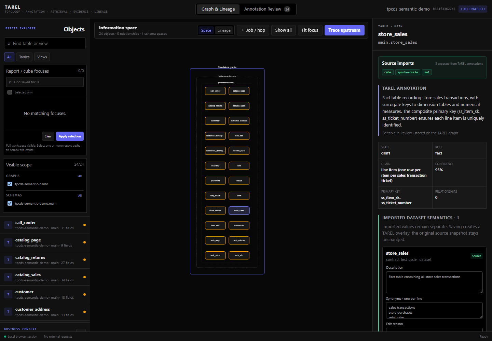

# Experimental three-format semantic contract test

On 2026-08-19, the experimental `tarel.semantic_import.v0.1` boundary was exercised with three
real, locally stored semantic-model examples: Apache Ossie, SML, and Cube YAML. The test checks one
shared persisted contract, deterministic normalization, explicit graph bindings, visible
diagnostics, and a browser projection that excludes the raw source snapshots.

This is an import-contract test. It is not a certification of full format compatibility, schema
conformance, export, or lossless round trips.

## Reproduce locally

The input examples live outside this public repository in the ignored/local extension fixture
repository. They are not redistributed by this test.

```bash
PYTHONPATH=src python3 tools/run_semantic_contract_test.py \
  --examples ../TAREL_Extensions/local/examples \
  --state-root .tarel \
  --graph tpcds-semantic-demo \
  --output .tarel/test-results/semantic-contract-3/report.json
```

The output path is ignored by Git. The JSON report contains hashes, aggregate counts, binding
counts, and diagnostic codes—not raw semantic files, database rows, credentials, or connection
details.

## Observed result

The run completed with `status: passed`. All three imports used exactly
`tarel.semantic_import.v0.1`; the browser projection contained three import summaries and three
normalized models while excluding all raw snapshots.

| Reader | Fixture version | Normalized | Exact graph bindings | Diagnostics |
|---|---:|---:|---:|---:|
| Apache Ossie | `0.2.0.dev0` | 5 datasets, 31 fields, 5 metrics, 4 relationships | 5 datasets, 29 fields | 13 |
| SML | `1.6` | 1 dataset, 19 fields, 2 metrics | 0 | 31 |
| Cube YAML | `yaml` | 2 datasets, 5 fields, 2 metrics, 1 relationship | 0 | 7 |

The zero SML and Cube bindings are expected for this run: their physical objects do not exist in
the TPC-DS graph used by the test, and the Cube fixtures identify datasets with inline SQL rather
than exact table names. TAREL retained the semantic objects as unbound and emitted diagnostics.
It did not invent fuzzy or LLM-derived graph links inside the kernel.

The Ossie relationship count is normalized source content, while the binding count is zero because
the local test graph has no corresponding declared `foreign_key` edges. That distinction is also
reported explicitly.

## GUI evidence



The inspector keeps the blue TAREL annotation layer separate from the green source-import layer.
Its import strip identifies all three formats. Imported values can receive TAREL overlay edits in
edit mode, while the original source value and snapshot identity remain unchanged.

## What this establishes

- A single format-neutral source snapshot and normalized contract can hold a file or multi-file
  semantic project.
- Independent readers can preserve unsupported constructs as diagnostics without changing the
  graph schema.
- Exact matches bind to stable graph IDs; missing evidence remains visibly unbound.
- Browser consumers receive normalized values, bindings, revisions, and diagnostics but never the
  raw source bundle.

It does not yet establish complete format coverage, a public plugin ABI, ontology mapping,
retrieval integration, export, or round-trip compatibility.
